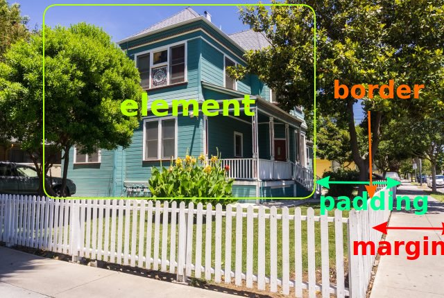
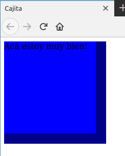
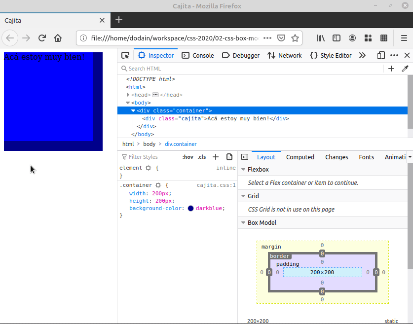
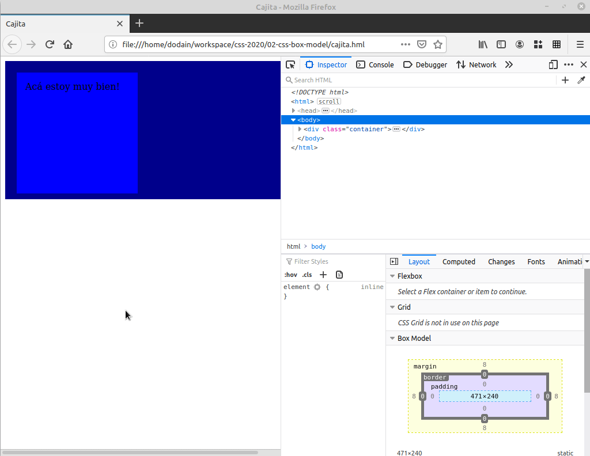
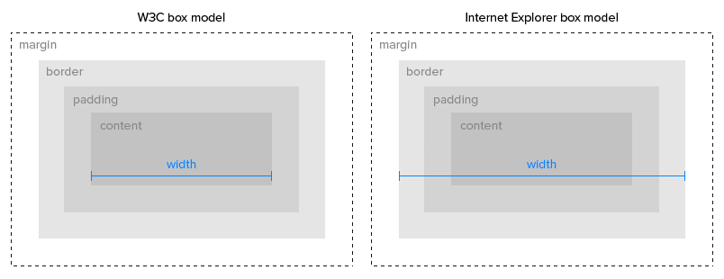
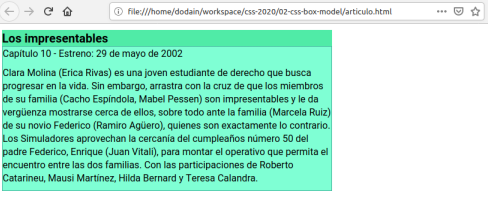
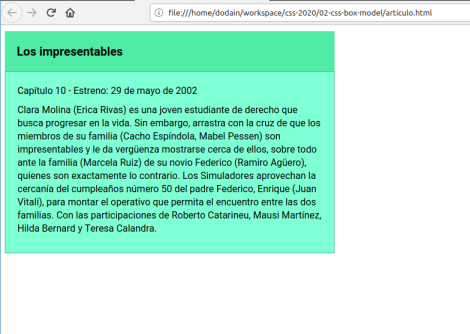
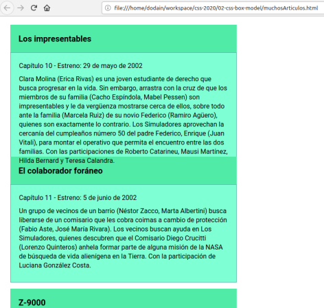
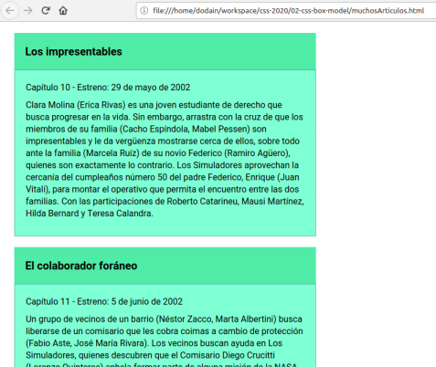
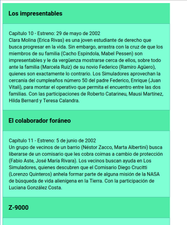

## El modelo de cajas

Una cuestión fundamental a la hora de maquetar una página web es entender su manejo espacial. Cada elemento define un _layout_ que puede verse gráficamente de la siguiente manera:


Si nuestro box model fuera una casa, cada concepto podría definirse así:



> Gracias a Jess Saavedra por el ejemplo didáctico.

Entonces tenemos:

- el elemento, que tiene su propio ancho (width) y alto (height)
- el padding, que marca la distancia entre el elemento y su borde
- el borde, que representa el límite de lo que está dentro del elemento y su exterior
- y el margen, que establece una separación (externa) entre los elementos

## Box Model Default y Border-Box

Entonces, si definimos una jerarquía de divs, donde el primero contiene al segundo:

```html
  <div class="container">
    <div class="cajita">
      Acá estoy muy bien!
    </div>
  </div>
```

¿qué pasa si container tiene 200px y cajita 180px?

```css
.container {
  width: 200px;
  height: 200px;
  background-color: darkblue;
}

.cajita {
  width: 180px;
  height: 180px;
  background-color: blue;
}
```



Perfecto, vemos que el div padre asoma a la derecha y abajo, porque no nos tomamos el trabajo de centrarlo. Pero ¿qué sucede si le aplicamos un padding de 15px a la cajita?

```css
.cajita {
  width: 180px;
  height: 180px;
  background-color: blue;
  padding: 15px;
}
```

Lo que ocurre es que dejamos de visualizar el div padre (el container). El motivo es que el _box model_ por defecto considera los 180px **únicamente para el elemento**. Entonces el div cajita termina ocupando

- 180px de ancho y 180px de alto
- pero además 15px de padding a la izquierda y 15px de padding a la derecha = 30px que se suman al ancho de 180px = 210px > 200px que tiene el container
- lo mismo ocurre con el padding vertical: arriba y abajo sumamos 15px y tenemos 210px de alto > 200 px del container

Lo podemos ver gráficamente:



Esto es porque el modelo de caja por defecto considera que el elemento tiene su propio tamaño, al cual hay que agregar **el borde** y **el padding**. Esto tiene algunas consecuencias molestas:

- hay que hacer cálculos a la hora de determinar cuál es el tamaño que queremos para un elemento
- si en alguna hoja de estilos en cascada el elemento agrega padding o borde, eso trastoca el cálculo que hicimos anteriormente
- no es posible definir un padding en porcentaje

En resumen, es muy frecuente que les pase que definan un div de 100% de ancho, al cual al agregarle padding termine agregando los molestos scrollbars. Reproducirlo es muy sencillo, basta con cambiar el width del container a 100% y agregarle padding o border:

```css
.container {
  width: 100%;
  ...
  padding: 20px;
}
```

Eso produce que se visualice la barra de scroll, no importa cuánto la extendamos, porque el container siempre trata de tomar el 100% del width, y luego le agrega 40 píxeles, 20 a izquierda y 20 a derecha:



Si nuestro div tuviera un height del 100%, lo mismo nos ocurriría con los scrollbars verticales.

## Box Sizing alternativo

En el mismo gif habrán notado que con la siguiente configuración se arreglan las molestas barras de desplazamiento:

```css
.container {
  ...
  box-sizing: border-box;
}
```

¿Qué diferencia tiene con el modelo de caja por defecto, que es `box-sizing: content-box`? En el modelo `border-box`, el width y el height que definimos incluye el borde y el padding:



Por eso cuando nosotros decimos que debe tomar el 100% del width, definirle borde o padding no le incrementa el tamaño del ancho, respeta el 100% que debe tener. Claro, si definimos un margin adicional, entonces sí veremos nuevamente las barras de scroll:

```css
.container {
  ...
  margin: 0 25px;
  ...  
}
```

(recordemos que cuando configuramos margin con dos valores, el primero es el vertical y el segundo es el horizontal, con iguales valores para cada extremo)

Si te interesa conocer un poco acerca de cómo surgió el box sizing (un bug/feature de Internet Explorer) te recomendamos que leas [este artículo](https://css-tricks.com/box-sizing/).

## Manejo del padding en un artículo

Vamos al archivo `articulo.html`, donde jugaremos un poco con el padding para mejorar la visualización de un elemento.



No se ve mal, tenemos un border sólido de 1px. Probemos primero definir un padding de 20px para el título y la caja:

```css
.cajita {
  ...
  padding: 20px;
}

.titulo {
  ...
  padding: 20px;
}
```

Esto ya produce cambios en la visualización:



### Margin para separar múltiples cajitas

En el archivo `muchosArticulos.html` tenemos varias reseñas de capítulos de una serie tomando como base el archivo anterior:



Ok, eso no se ve bien, tomaremos todo el height necesario para que nos entre toda la explicación de cada capítulo:

```css
.container {
  ...
  height: 100%;
}
```

Ahora sí:



Y un detalle importante, el margin nos permite que no se encimen todas las cards. Si comentamos los márgenes para `section` y `section.container`

```css
section {
  /* margin: 10px 0px; */
}

section.container {
  /* margin: 20px; */
}
```

esto produce que no haya separación de las tarjetas, lo que visualmente produce que el usuario tenga que esforzarse para detectar título y contenido de cada capítulo:



Nos queda para ejemplos posteriores

- que el layout aproveche más la organización espacial de la página
- dejar de pensar en valores absolutos (píxeles) y usar valores relativos

TODO: Leer el último artículo padding vs. margin y ver si hace falta aclarar algo.

## Artículos de interés

- [What is wrong with the CSS Box Model, and how to fix it](https://pressupinc.com/blog/2014/01/whats-wrong-css-box-model-fix/)
- [The CSS Default Box Model is Utter Madness: A Parable | Press Up](https://pressupinc.com/blog/2014/01/css-default-box-model-utter-madness-parable/)
- [The CSS Box Model](https://css-tricks.com/the-css-box-model/)
- [Padding vs. Margin](https://uxengineer.com/padding-vs-margin/)
